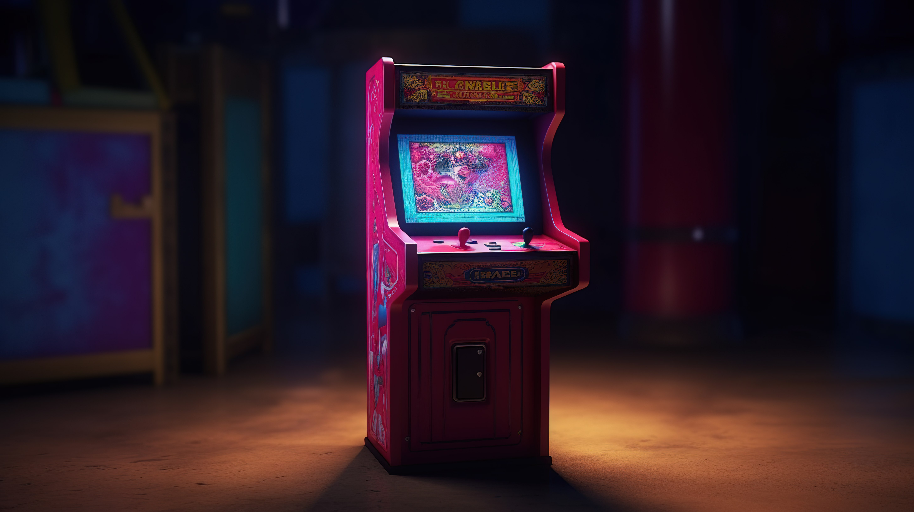

# RL-Arcade

Reinforcement learning agents trained to play classic arcade and platformer games (Super Mario, Sonic, and more) using deep RL algorithms. Python 3.14, Gymnasium-native, PPO via [stable-baselines3](https://stable-baselines3.readthedocs.io/).

I wanted to know a bit more about Reinforcement learning agents so I went to YT and most of the videos were super outdated and not clear for me to undestand plus
all the libraries were outdated as well so I decided to build it myself.

- Made it with proper architecture so that the games are plug&play.
- Currently ships [Super Mario Bros (NES)](docs/mario.md).
- In-progress [SonicTheHedgehog-Genesis]().

Hopefully this repo will help someone in same situation as Im/was. Thx. After clock project - SirTomas.

- Working on full YouTube video tutorial (Soon)
- If u do leave a star ⭐
- Issues and improvements are more than welcome.

---


## 1. Install

Needs **Python 3.13 or newer** (this repo runs 3.14) and a CUDA GPU to be faast.

```bash
git clone <this-repo> rl-arcade
cd rl-arcade

python3.14 -m venv env314          # any 3.13+ works
source env314/bin/activate

# CUDA build of torch first -- otherwise pip gives you the CPU-only one
pip install torch --index-url https://download.pytorch.org/whl/cu124

pip install -r requirements.txt
```

[requirements.txt](requirements.txt) pins the versions this was built on. If
you don't have an NVIDIA GPU, skip the torch line — `requirements.txt` will
install the CPU build for you.

Check it worked:

```bash
python -c "import torch; print('GPU:', torch.cuda.is_available())"
```

If that prints `False` you'll train on CPU — it works, just slowly. Set
`device="cpu"` in [config.py](config.py) to silence the warning.

The Mario ROM ships legally inside `gym-super-mario-bros`. Nothing to download.

### Activating

**Activation dies with the terminal.** Every new terminal needs it again:

```bash
source env314/bin/activate     # prompt shows (env314)
```

Check with `which python` — it should print an `env314` path. Or skip
activation entirely and call the venv's Python directly:

```bash
python scripts/train.py
```


## 2. Run it

Three commands, in the order you'd actually use them:

```bash
# 1. Train. Writes to logs/mario/ and board/mario/.
python scripts/train.py

# 2. Watch what it learned.
python scripts/play.py
```

Watch it learn, in another terminal:

```bash
tensorboard --logdir board/
```

The number to watch is `rollout/ep_rew_mean`. It should climb. If it's flat
after ~200k steps, something's wrong.

### Useful flags

```bash
python scripts/train.py --cpus 4           # fewer parallel envs (less RAM)
python scripts/train.py --timesteps 50000  # short run, to test changes
python scripts/train.py --no-resume        # ignore the saved checkpoint, start fresh
python scripts/play.py --fps 30            # play back faster
```


### Resuming

`scripts/train.py` **resumes automatically** if `logs/mario/best_model.zip`
exists. That's usually what you want. Two things to know:

- Changing hyperparameters in `config.py` and resuming does **not** fully apply
them — most values are baked into the `.zip`. Only `learning_rate` and
`target_kl` are overridden (see `resume_overrides()` in [config.py](config.py)).
- To genuinely start over, use `--no-resume`, or delete `logs/mario/best_model.zip`.

Each run gets its own `logs/mario/run_<timestamp>/` folder, so restarting never
overwrites an old run's history.

## 3. How it's organised

```
config.py          all hyperparameters, one place
core/              the engine — knows nothing about any specific game
├── spec.py        GameSpec: the "socket" a game plugs into
├── vec.py         builds the parallel envs
├── wrappers.py    StallLimit (ends an episode when the agent stops progressing)
├── run_dirs.py    where logs and checkpoints go
├── trainer.py     the PPO loop
└── rollout.py     the watch-it-play loop
games/             the plugs — one folder per game
└── mario/game.py  the ONLY Mario-specific file
scripts/           thin CLIs you actually run
docs/              README images and per-game docs
```

The one rule: `core/` **never imports a game.** It receives a `GameSpec` as an
argument. That's what makes a second game cost one file instead of a fork.

## 4. Adding a new game

Say you want Sonic. Make one folder, one file:

```
games/sonic/
├── __init__.py     from games.sonic.game import SPEC
└── game.py
```

`games/sonic/game.py` needs exactly two things — a `preprocess()` function and
a `SPEC`:

```python
from gymnasium.wrappers import GrayscaleObservation, MaxAndSkipObservation, ResizeObservation
from config import FRAME_SKIP, RESIZE, STALL_PATIENCE
from core.spec import GameSpec
from core.wrappers import StallLimit

def preprocess(env):
    # whatever your game needs: action-space remap, resize, grayscale, skip
    env = MaxAndSkipObservation(env, skip=FRAME_SKIP)
    env = StallLimit(env, patience=STALL_PATIENCE, progress_key="x")
    env = ResizeObservation(env, RESIZE)
    return GrayscaleObservation(env, keep_dim=True)

SPEC = GameSpec(
    name="sonic",              # -> logs/sonic/, board/sonic/
    env_id="SonicTheHedgehog-Genesis",
    preprocess=preprocess,
    progress_key="x",          # the info[] key that means "made progress"
    report_keys=("x", "rings"),
)
```

That's it. `--game sonic` now appears in both CLIs automatically:

```bash
python scripts/train.py --game sonic
python scripts/play.py --game sonic
```

You edit **nothing** in `core/`.

### What each GameSpec field means


| field          | what it's for                                                            |
| -------------- | ------------------------------------------------------------------------ |
| `name`         | slug for `logs/<name>/` and `board/<name>/`. Keeps games from colliding. |
| `env_id`       | the id the game is registered under in Gymnasium                         |
| `preprocess`   | env → wrapped env. Owns everything game-specific.                        |
| `progress_key` | `info[]` key `StallLimit` watches. Mario uses `x_pos`.                   |
| `report_keys`  | `info[]` keys printed after each episode during play                     |
| `frame_stack`  | frames stacked for motion. Must match between train and play.            |


### Things to be aware of

- `preprocess` **must be identical for training and play.** It is, because both
go through the same `SPEC` — but if you edit it after training, your saved
model sees a different observation than it learned on and plays like garbage.
Retrain after changing it.
- **The action-space remap belongs in** `preprocess`, not in `core/`. Mario uses
`JoypadSpace` from nes-py, which only exists for NES games.
- **Pick the right** `progress_key`**.** If the key never appears in `info`,
`StallLimit` sees no progress and truncates every episode at 80 steps.
- **A** `SPEC` **per level.** Mario is `SuperMarioBros-1-1-v0` — level 1-1 only.
Other levels are separate `env_id`s, so give each its own `name` too.


## 5. Games

- [Mario](games/mario/mario.md) — Super Mario Bros NES, reward function, preprocessing, gotchas.


## 6. Gotchas

- **Ignore pre-2023 tutorials** showing `obs = env.reset()` or a 4-value `step()`.
That API is dead — `reset()` returns `(obs, info)` and `step()` returns 5 values.
- **Ignore anything about gym-retro,** `shimmy`**, or** `apply_api_compatibility`**.**
Those were needed only on Python ≤3.12, where pip serves the 2021-era packages.
On 3.13+ you get the modern versions and none of it applies.
- **Requires Python 3.13+.** On older Python, pip silently installs
gym-super-mario-bros 7.4.0 instead of 9.1.0 — that's the old-gym version that
needs all the shims. If you see `import gym` anywhere, you're on the old stack.
- `--cpus 10` **is the default and it's hungry.** Each one is a full NES
emulator process. Drop to `--cpus 4` if you're short on RAM.


## Docs

- [Gymnasium](https://gymnasium.farama.org/) — the core API
- [gym-super-mario-bros](https://github.com/Kautenja/gym-super-mario-bros) — env ids, action sets
- [SB3 RL Tips](https://stable-baselines3.readthedocs.io/en/master/guide/rl_tips.html) — why your agent isn't learning
- Best reference is local: `env314/lib/python3.14/site-packages/gym_super_mario_bros/smb_env.py`

