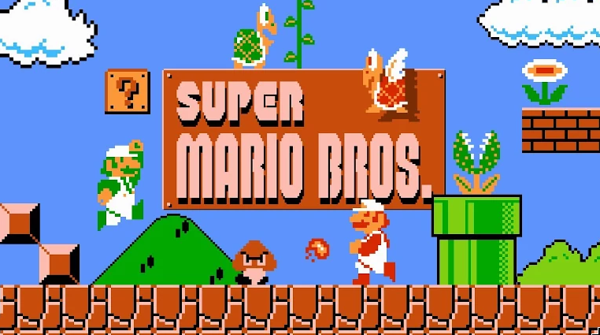
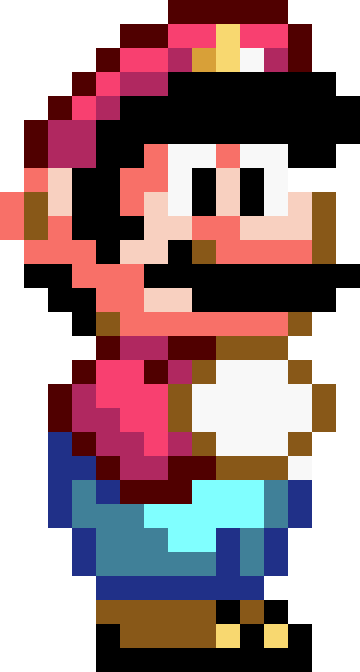

#  Mario RL Agent

Reinforcement learning on Super Mario Bros (NES), Python 3.14, Gymnasium-native.

The learning is PPO [stable-baselines3](https://stable-baselines3.readthedocs.io/)

## Run it

```bash
uv run scripts/train.py --game mario
uv run scripts/play.py --game mario
```

See the [main README](../../README.md) for install, architecture, and how to add a new game.

## The reward function

The whole objective the agent optimizes:

```
reward = x_reward + time_penalty + death_penalty
```

- `x_reward` — change in x-position, clipped to ±5. Moving right pays.
- `time_penalty` — the in-game clock ticking down. Always negative.
- `death_penalty` — `-25`.

Coins and enemies are worth **nothing**. That's why agents learn to sprint right
and ignore everything else.

## Preprocessing

Raw frames are a bad training input, so `preprocess()` in
[game.py](game.py) stacks wrappers:

- **JoypadSpace(RIGHT_ONLY)** — 256 NES button combinations down to 5 actions.
- **`pixel_pipeline`** (from rlforge) does three steps:
  - **MaxAndSkip(4)** — hold each action 4 frames. NES is 60fps; deciding that often is wasted compute.
  - **Resize(84x84)** — down from 240x256.
  - **Grayscale** — color doesn't help Mario. 3x less data.
- **StallLimit(80)** — ends the episode after 80 decisions without moving right.
- **FrameStack(4)** (added by rlforge in `vec.py`) — one still frame can't show whether Mario is rising or falling. Stacking gives the network motion.

Net effect: `240x256x3` → `84x84x4`, roughly 26x less data per decision.

## The stack

- **nes-py 9.0.1** — the actual NES emulator (C++). Runs the console.
- **gym-super-mario-bros 9.1.0** — feeds it the Mario ROM (shipped legally) and reads RAM for rewards and the `info` dict.
- **gymnasium 1.3** — the `reset()` / `step()` API.
- **stable-baselines3 2.9 + torch 2.14 (CUDA)** — the learning algorithms (PPO), on the GPU.

No `gym`, no `shimmy`, no compatibility shims. Everything is Gymnasium-native.

## Gotchas

- **Stay on `v0`.** The version suffix is a *graphics mode*, not a revision:
  `v0`=vanilla, `v1`=downsample, `v2`=pixel, `v3`=rectangle. v3 renders Mario as
  colored rectangles.
- **A `SPEC` per level.** Mario is `SuperMarioBros-1-1-v0` — level 1-1 only.
  Other levels are separate `env_id`s, so give each its own `name` too.
